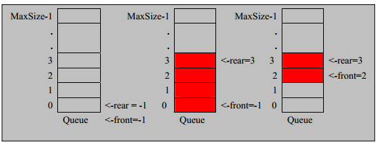

## CircleArrayQueue(环形队列)

<hr>

>为了解决<a href="/ArrayQueue.md">数组模拟实现队列</a>遗留的缺陷，尝试用CircleArrayQueue来优化。
>
>

#### 环形队列思路：

>+ front变量的含义，做以下调整：
>  + front就指向队列的第一个元素，也就是说arr[front]就是队列的第一个元素，front初始值为0
>+ rear变量的含义，做以下调整：
>  + rear指向队列的最后一个元素的后一个位置，空出一个空间作为约定（一种算法实现思路，不唯一）
>+ 判断队列为满：`(rear + 1) % maxSize == front`
>+ 判断队列为空：`front == rear`（默认初始值都为0）
>+ 队列中的有效数据个数：`(rear + maxSize - front) % maxsize`


<hr>

#### 细节：

>+ ```java
>     //创建队列的构造器
>     public CircleArrayQueue(int maxSize) {
>         this.maxSize = maxSize;
>         arr = new int[this.maxSize];           //创建对应长度的队列
>         //front & rear 默认给定的值为 0 ，所以可以省略赋值操作
>     }
>     ```

>+ ```java
>    //判断队列是否为满
>    public boolean isFull() {
>        return (rear + 1) % maxSize == front;
>    }
>    ```

>+ ```java
> //添加数据到队列
>    public void addQueue(int num) {
>        //判断队列是否为满
>        if (isFull()) {
>            System.out.println("队列已满不能添加有效数据！");
>            return;
>        }
>        //rear初始值为0，直接指向的就是下一个位置。所以可以直接将数据加入
>        arr[rear] = num;
>        //因为要做成环形队列，所以 rear 取模向后 ++
>        rear = (rear + 1) % maxSize;
>    }
>   ```

>+ ```java
>    //获取队列中的数据，出队列
>    public int getQueue() {
>        //判断队列是否为空
>        if (isEmpty()) {
>            //抛出异常
>       throw new RuntimeException("队列为空，无法获取有效数据 ！");
>        }
>        //这里不能直接将front返回，需要经过三步
>        /*
>         *   1. 先将front 对应的数据取出给临时变量 value
>         *   2. 将 front 后移 （取模后++）
>         *   3. 将临时变量存放的数据返回
>         */
>        int value = arr[front];
>        front = (front + 1) % maxSize;
>        return value;
>    }
>    ```

>+ ```java
>     //显示队列中的有效数据
>     public void showQueue() {
>         //判断队列是否为空
>         if (isEmpty()) {
>         throw new RuntimeException("队列为空，无法获取到有效数据！ ");
>         }
>         //因为添加了环形操作，所以这里不能再fori循环遍历取值了
>         //思路: 从 front开始向后遍历多少个数据进行输出打印
>         for (int i = front; i < front + size(); i++) {
>             System.out.printf("arr[%d]=%d\n", i % maxSize, arr[i % maxSize]);
>         }
>     }
>     ```
>

>+ ```java
>    //获取队列中的有效数据个数  ==》 用于取代静态的arr.length
>    public int size() {
>        return (rear + maxSize - front) % maxSize;
>    }
>    ```


<hr>

##### 代码实现：

```java
package Queue;
import java.util.Scanner;
/**
 * Created with IntelliJ IDEA.
 * User: Joeo8
 * Time: 17:17
 * Description: No Description
 */
public class CircleArrayQueueDemo {
    //测试CircleArrayQueue
    public static void main(String[] args) {
         CircleArrayQueue arrayQueue = new CircleArrayQueue(4);
        char key = ' ';   //用于接收用户输入的命令
        Scanner scanner = new Scanner(System.in);
        boolean loop = true;
        //输入一个菜单
        while (loop) {
System.out.println("===========CircleArrayQueue============");
            System.out.println("s --> show : 显示队列");
            System.out.println("e -->  exit : 退出系统");
            System.out.println("a -->   add : 添加数据到队列");
            System.out.println("g -->    get : 从队列中取出数据");
            System.out.println("h -->   head : 查看队列头数据");
 System.out.println("===========CircleArrayQueue============");
            key = scanner.next().charAt(0);              //接收用户输入命令
            switch (key) {
                case 's':                            //显示队列
                    try {
                        arrayQueue.showQueue();
                    } catch (Exception e) {
                        e.printStackTrace();
                    }
                    break;
                case 'e':                             //退出系统
                    scanner.close();
                    loop = false;
                    break;
                case 'a':                              //向队列添加数据
                    try {
                        System.out.println("请输入要添加的数据");
                        int num = scanner.nextInt();
                        arrayQueue.addQueue(num);
                    } catch (Exception e) {
                        e.printStackTrace();
                    }
                    break;
                case 'g':                               //获取队列中的数据
                    try {
                        int res = arrayQueue.getQueue();
                        System.out.printf("取出的数据是\t%d \n", res);
                    } catch (Exception e) {
                        e.printStackTrace();
                    }
                    break;
                case 'h':                                 //查看队列的头数据
                    try {
                        int head = arrayQueue.headQueue();
                        System.out.printf("队列的头数据是\t%d\n",head);
                    } catch (Exception e) {
                        e.printStackTrace();
                    }
                    break;
                default:
                    break;
            }
        }
            System.out.println("队列退出！");
    }
    }


class CircleArrayQueue {
    private int maxSize;  //表示数组的最大容量
    private int front;        //front做调整，指向队列中的第一个元素，默认初始值为0
    private int rear;          //rear做调整，约定指向最后一个元素的后一个位置，默认初始值为0
    private int[] arr;        //该数组用于存放数据，模拟队列

    //创建队列的构造器
    public CircleArrayQueue(int maxSize) {
        this.maxSize = maxSize;
        arr = new int[this.maxSize];           //创建对应长度的队列
        //front & rear 默认给定的值为 0 ，所以可以省略赋值操作
    }

    //判断队列是否为满
    public boolean isFull() {
        return (rear + 1) % maxSize == front;
    }

    //判断队列是否为空
    public boolean isEmpty() {
        return front == rear;
    }

    //添加数据到队列
    public void addQueue(int num) {
        //判断队列是否为满
        if (isFull()) {
            System.out.println("队列已满不能添加有效数据！");
            return;
        }
        //rear初始值为0，直接指向的就是下一个位置。所以可以直接将数据加入
        arr[rear] = num;
        //因为要做成环形队列，所以 rear 取模向后 ++
        rear = (rear + 1) % maxSize;
    }

    //获取队列中的数据，出队列
    public int getQueue() {
        //判断队列是否为空
        if (isEmpty()) {
            //抛出异常
            throw new RuntimeException("队列为空，无法获取有效数据 ！");
        }
        //这里不能直接将front返回，需要经过三步
        /*
         *   1. 先将front 对应的数据取出给临时变量 value
         *   2. 将 front 后移 （取模后++）
         *   3. 将临时变量存放的数据返回
         */
        int value = arr[front];
        front = (front + 1) % maxSize;
        return value;
    }

    //显示队列中的有效数据
    public void showQueue() {
        //判断队列是否为空
        if (isEmpty()) {
            throw new RuntimeException("队列为空，无法获取到有效数据！ ");
        }
        //因为添加了环形操作，所以这里不能再fori循环遍历取值了
        //思路: 从 front开始向后遍历多少个数据进行输出打印
        for (int i = front; i < front + size(); i++) {
            System.out.printf("arr[%d]=%d\n", i % maxSize, arr[i % maxSize]);
        }
    }

    //获取队列中的有效数据个数  ==》 用于取代静态的arr.length
    public int size() {
        return (rear + maxSize - front) % maxSize;
    }

    //显示队列的头元素（只是显示，不是取出）
    public int headQueue() {
        //判断队列是否为空
        if (isEmpty()) {
            throw new RuntimeException("队列为空，无法获取头元素！");
        }
        return arr[front];
    }
}
```

#### Output:

```java
===========CircleArrayQueue============
s --> show : 显示队列
e -->  exit : 退出系统
a -->   add : 添加数据到队列
g -->    get : 从队列中取出数据
h -->   head : 查看队列头数据
===========CircleArrayQueue============
s
java.lang.RuntimeException: 队列为空，无法获取到有效数据！ 
	at Queue.CircleArrayQueue.showQueue(CircleArrayQueueDemo.java:130)
	at Queue.CircleArrayQueueDemo.main(CircleArrayQueueDemo.java:29)
===========CircleArrayQueue============
s --> show : 显示队列
e -->  exit : 退出系统
a -->   add : 添加数据到队列
g -->    get : 从队列中取出数据
h -->   head : 查看队列头数据
===========CircleArrayQueue============
a
请输入要添加的数据
10
===========CircleArrayQueue============
s --> show : 显示队列
e -->  exit : 退出系统
a -->   add : 添加数据到队列
g -->    get : 从队列中取出数据
h -->   head : 查看队列头数据
===========CircleArrayQueue============
s
arr[0]=10
===========CircleArrayQueue============
s --> show : 显示队列
e -->  exit : 退出系统
a -->   add : 添加数据到队列
g -->    get : 从队列中取出数据
h -->   head : 查看队列头数据
===========CircleArrayQueue============
a
请输入要添加的数据
20
===========CircleArrayQueue============
s --> show : 显示队列
e -->  exit : 退出系统
a -->   add : 添加数据到队列
g -->    get : 从队列中取出数据
h -->   head : 查看队列头数据
===========CircleArrayQueue============
s
arr[0]=10
arr[1]=20
===========CircleArrayQueue============
s --> show : 显示队列
e -->  exit : 退出系统
a -->   add : 添加数据到队列
g -->    get : 从队列中取出数据
h -->   head : 查看队列头数据
===========CircleArrayQueue============
a
请输入要添加的数据
30
===========CircleArrayQueue============
s --> show : 显示队列
e -->  exit : 退出系统
a -->   add : 添加数据到队列
g -->    get : 从队列中取出数据
h -->   head : 查看队列头数据
===========CircleArrayQueue============
s
arr[0]=10
arr[1]=20
arr[2]=30
===========CircleArrayQueue============
s --> show : 显示队列
e -->  exit : 退出系统
a -->   add : 添加数据到队列
g -->    get : 从队列中取出数据
h -->   head : 查看队列头数据
===========CircleArrayQueue============
a
请输入要添加的数据
40
队列已满不能添加有效数据！
===========CircleArrayQueue============
s --> show : 显示队列
e -->  exit : 退出系统
a -->   add : 添加数据到队列
g -->    get : 从队列中取出数据
h -->   head : 查看队列头数据
===========CircleArrayQueue============
s
arr[0]=10
arr[1]=20
arr[2]=30
===========CircleArrayQueue============
s --> show : 显示队列
e -->  exit : 退出系统
a -->   add : 添加数据到队列
g -->    get : 从队列中取出数据
h -->   head : 查看队列头数据
===========CircleArrayQueue============
h
队列的头数据是	10
===========CircleArrayQueue============
s --> show : 显示队列
e -->  exit : 退出系统
a -->   add : 添加数据到队列
g -->    get : 从队列中取出数据
h -->   head : 查看队列头数据
===========CircleArrayQueue============
g
取出的数据是	10 
===========CircleArrayQueue============
s --> show : 显示队列
e -->  exit : 退出系统
a -->   add : 添加数据到队列
g -->    get : 从队列中取出数据
h -->   head : 查看队列头数据
===========CircleArrayQueue============
s
arr[1]=20
arr[2]=30
===========CircleArrayQueue============
s --> show : 显示队列
e -->  exit : 退出系统
a -->   add : 添加数据到队列
g -->    get : 从队列中取出数据
h -->   head : 查看队列头数据
===========CircleArrayQueue============
a
请输入要添加的数据
40
===========CircleArrayQueue============
s --> show : 显示队列
e -->  exit : 退出系统
a -->   add : 添加数据到队列
g -->    get : 从队列中取出数据
h -->   head : 查看队列头数据
===========CircleArrayQueue============
s
arr[1]=20
arr[2]=30
arr[3]=40
===========CircleArrayQueue============
s --> show : 显示队列
e -->  exit : 退出系统
a -->   add : 添加数据到队列
g -->    get : 从队列中取出数据
h -->   head : 查看队列头数据
===========CircleArrayQueue============
h
队列的头数据是	20
===========CircleArrayQueue============
s --> show : 显示队列
e -->  exit : 退出系统
a -->   add : 添加数据到队列
g -->    get : 从队列中取出数据
h -->   head : 查看队列头数据
===========CircleArrayQueue============
g
取出的数据是	20 
===========CircleArrayQueue============
s --> show : 显示队列
e -->  exit : 退出系统
a -->   add : 添加数据到队列
g -->    get : 从队列中取出数据
h -->   head : 查看队列头数据
===========CircleArrayQueue============
a
请输入要添加的数据
50
===========CircleArrayQueue============
s --> show : 显示队列
e -->  exit : 退出系统
a -->   add : 添加数据到队列
g -->    get : 从队列中取出数据
h -->   head : 查看队列头数据
===========CircleArrayQueue============
s
arr[2]=30
arr[3]=40
arr[0]=50
===========CircleArrayQueue============
s --> show : 显示队列
e -->  exit : 退出系统
a -->   add : 添加数据到队列
g -->    get : 从队列中取出数据
h -->   head : 查看队列头数据
===========CircleArrayQueue============
e
队列退出！

Process finished with exit code 0
```

