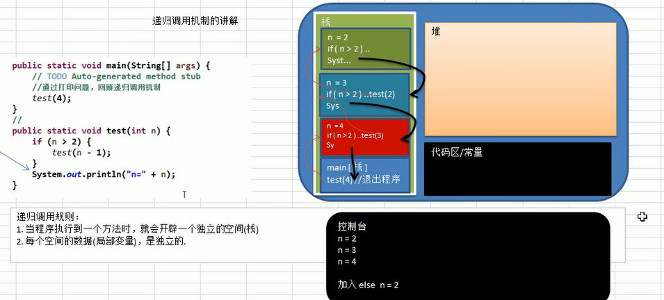

## Recursion(递归)

<hr>

>#### 递归：
>
>​		递归就是方法自己调用自己,每次调用时传入不同的变量。递归有助于编程者解决复杂的问题,同时也可以提升代码的简洁性。但是使用递归时,应注意临界值限定（递归吃内存）





>#### 递归调用的原则:
>
>+ 当程序执行到一个方法时,就会开辟一个新的受保护的独立空间（栈帧）  《==   JVM
>+ 方法的局部变量是独立的,不会相互影响,比如n变量
>+ 如果方法中使用的引用类型变量（比如数组）,就会共享该引用类型的数据
>+ 递归必须向退出递归的条件逼近,否则就会无限递归 （`StackOverFlow`）
>+ 当一个方法执行完毕,或者遇到`return`,就会返回（遵守谁调用，就将结果返回给谁）同时当方法执行完毕或者返回时,该方法也就执行完毕。


<hr>

```java
package Recursion;

/**
 * Created with IntelliJ IDEA.
 * User: Joeo8
 * Time: 13:24
 * Description: Recursion Test
 */
public class RecursionTest {
    public static void main(String[] args) {
        //通过打印问题,回顾递归调用机制
        //test(4);                           //2,3,4
        int res = factorial(4);
        System.out.println("结果为: " + res); //24  <== (1*2*3*4)
    }


    //打印问题
    public static void test(int n) {
        if (n >= 2) {
            test(n - 1);
        }
        System.out.println("n=" + n);
    }

    //阶乘问题
    public static int factorial(int n) {
        if (n == 1) {
            return 1;
        } else {
            return factorial(n - 1) * n;
        }
    }

}

```

