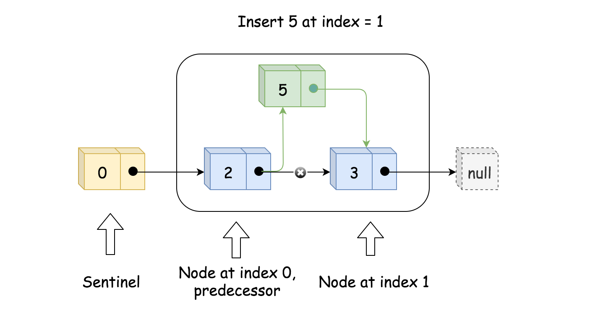
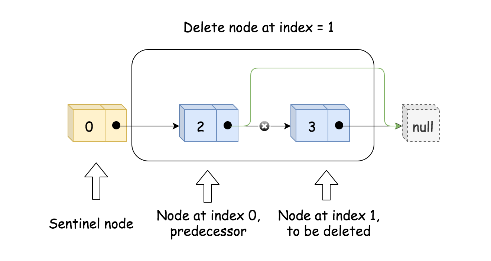
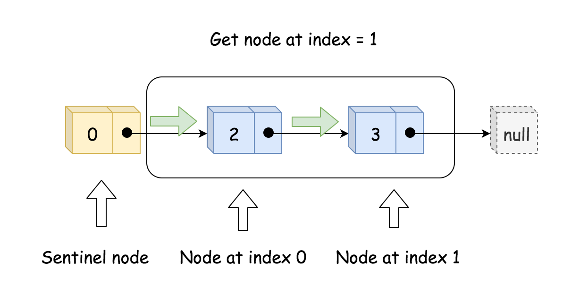

## SingleLinkedList（单链表）

<hr>

#### SingleLinkedList

>+ 单链表结构中，将数据存放在各个节点中。如下图所示，在每个节点内部，有两部组成。（data+next）即数据和指针。所谓单链表无疑是链式存储方式，节点中的next指针指向下一个节点，存储空间不是连续的。
>
>+ 
>
>+ 单链表结构中有两种形式（下文以带头结点的单链表为例）
>
>   + 带头结点的单链表
>
>  `头节点起标记作用，节点中不存放具体数据。next指向第一个有具体数据的节点`
>
>   + 不带头结点的单链表
>


<hr>

#### Operation


>+ ##### 添加节点：
>
>  + 直接从尾部添加（不考虑顺序）
>
>    ```java
>    //添加节点到链表中  (当不考虑编号时，找到最后一个节点，然后将next指向新增的节点)
>        public void add(HeroNode heroNode) {
>            //head头节点不能动，此时用一个辅助变量temp记录头节点
>            HeroNode temp = head;
>            //遍历链表，找到链表的最后一个节点
>            while (true) {
>                if (temp.next == null) {
>                    break;           //此时说明已经到链表的最后一个
>                }
>                //如果没有到最后一个节点，将temp指向后一个节点
>                temp = temp.next;
>            }
>            //退出while循环之后，此时可以保证temp指向最后一个节点
>            temp.next = heroNode;         //将最后一个节点指向新的节点，完成添加
>        }
>    ```
>
>  + <font style="color:red">顺序添加</font> （根据节点中的编号有序添加）--> <font style="color:pink">可以实现在内存中完成排序</font>
>
>  + 
>
>    ```java
>     //添加方法升级(按编号顺序添加)
>        public void addByOrder(HeroNode heroNode) {
>            //定义一个标识记录特殊情况（编号重复不能插入）
>            boolean flag = false;
>            //定义temp辅助变量拿到head
>            HeroNode temp = head;
>            //遍历
>            while (true) {
>                if (temp.next == null) {   //到了单链表的最后一个位置
>                    break;
>                }
>                if (temp.next.no > heroNode.no) {                      			 //此时位置正合适
>                    break;
>                } else if (temp.next.no == heroNode.no) {           			//编号重复，做好记录
>                    flag = true;
>                    break;
>                }
>                temp = temp.next;
>            }
>            //出了while循环就要对flag进行判断
>            if (flag) {    //flag为true表明编号已存在，不可添加
>                System.out.println("该编号已存在 , 不可重复添加！");
>            } else {
>          //此时，让新节点指向原本temp的下一个节点，并让temp指向新的节点
>                heroNode.next = temp.next;
>                temp.next = heroNode;
>            }
>        }
>    ```
>
>+ ##### 删除节点
>
>  + 遍历单链表,寻找时机 `temp.next.no == no`
>
>  + 修改`temp.next =temp.next.next`;
>
>  + 
>
>    ```java
>    //删除节点
>        public void del(int no) {
>            HeroNode temp = head;
>            boolean flag = false;
>            while (true) {
>                if (temp.next == null) {      //已经到了链表的最后
>                    break;
>                }
>                if (temp.next.no == no) {    //删除时机
>                    flag = !flag;
>                    break;
>                }
>                temp = temp.next;
>            }
>            //出了while只有两种情况：找到该节点，或者该节点不存在
>            if (flag) {
>                temp.next = temp.next.next;
>            } else {
>                System.out.println("不存在该节点！");
>            }
>        }
>    ```
>
>+ ##### 修改节点：
>
>  + 根据节点的编号，对其余内容进行重新赋值
>
>    ```java
>    //修改节点信息（根据no编号进行修改，即no不可更改）
>        public void update(HeroNode heroNode) {
>            //判断链表是否为空
>            if (head.next == null) {
>                System.out.println("链表为空！");
>                return;
>            }
>            //根据no编号索引需要修改的节点数据
>            HeroNode temp = head.next;
>            boolean flag = false;
>            while (true) {
>                if (temp == null) {
>                    break; //表示已经遍历完链表
>                }
>                if (temp.no == heroNode.no) {
>                    flag = true;
>                    break;
>                }
>                temp = temp.next;
>            }
>            //根据flag判断是否找到要修改的节点
>            if (flag) {
>                temp.name = heroNode.name;
>                temp.nickname = heroNode.nickname;
>            } else {
>                //没有找到要修改的节点
>                System.out.println("没要找到节点信息，无法进行修改！");
>            }
>    ```
>
>+ ##### 查询节点
>
>  + 遍历单链表，根据编号查找对应节点，打印输出
>
>  + 
>
>    ```java
>    //查询对应节点信息
>        public void get(int no) {
>            //判断链表是否未空
>            if (head.next == null) {
>                System.out.println("链表为空！");
>            }
>            HeroNode temp = head.next;
>            boolean flag = false;
>            while (true) {
>                if (temp == null) {
>                    break;
>                }
>                if (temp.no == no) {
>                    flag = !flag;
>    //                System.out.println(temp);
>                    break;
>                }
>                temp = temp.next;
>            }
>            if (flag) {
>                System.out.println(temp);
>            } else {
>                System.out.println("不存在该节点！");
>            }
>        }
>    
>    ```


<hr>

#### Output

```java

===============SingleLinkedList==============
链表为空！
===================添加完成==================
HeroNode{no=1, name='宋江', nickname='及时雨'}
HeroNode{no=2, name='卢俊义', nickname='玉麒麟'}
HeroNode{no=3, name='吴用', nickname='智多星'}
HeroNode{no=4, name='林冲', nickname='豹子头'}
该编号已存在 , 不可重复添加！
===================删除完成==================
HeroNode{no=2, name='卢俊义', nickname='玉麒麟'}
HeroNode{no=3, name='吴用', nickname='智多星'}
===================修改完成==================
HeroNode{no=2, name='俊逸', nickname='麒麟'}
HeroNode{no=3, name='吴用', nickname='智多星'}
===================查询完成==================
HeroNode{no=2, name='俊逸', nickname='麒麟'}
===================查询完成==================
HeroNode{no=2, name='俊逸', nickname='麒麟'}
HeroNode{no=3, name='吴用', nickname='智多星'}
===============SingleLinkedList==============

Process finished with exit code 0


```

